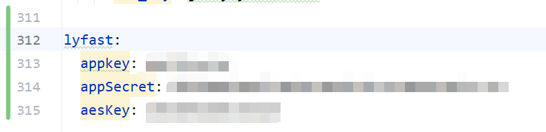

# LyFast
羚羊工业互联网用户信息快速获取
## 配置项
appkey配置  
`lyfast.appkey: xxxxxx`  
appSecret配置  
`lyfast.appSecret: xxxxx`  
aeskey配置  
`lyfast.aesKey: xxxxx`

## 使用方式
注入帮助类  
`@Autowired`  
`private LyUtils lyUtils;`  
调用方法传入token  
`lyUtils.getLyUserInfoByToken(token)`

## 反馈信息
`LingYangUserInfo类数据结构与羚羊官网一致`